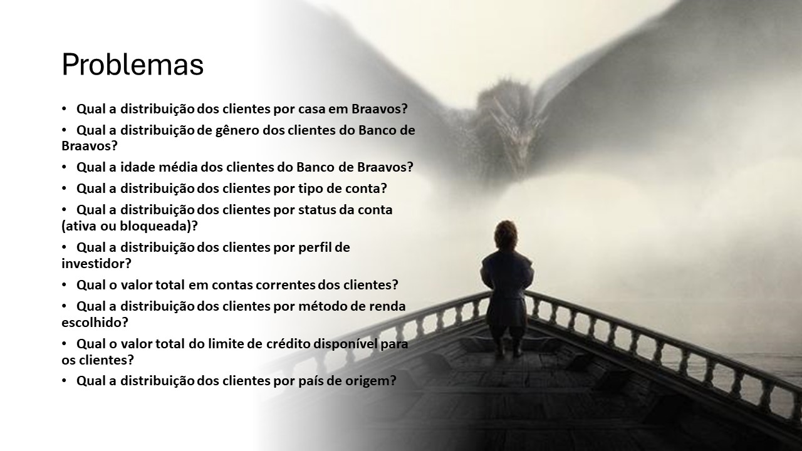
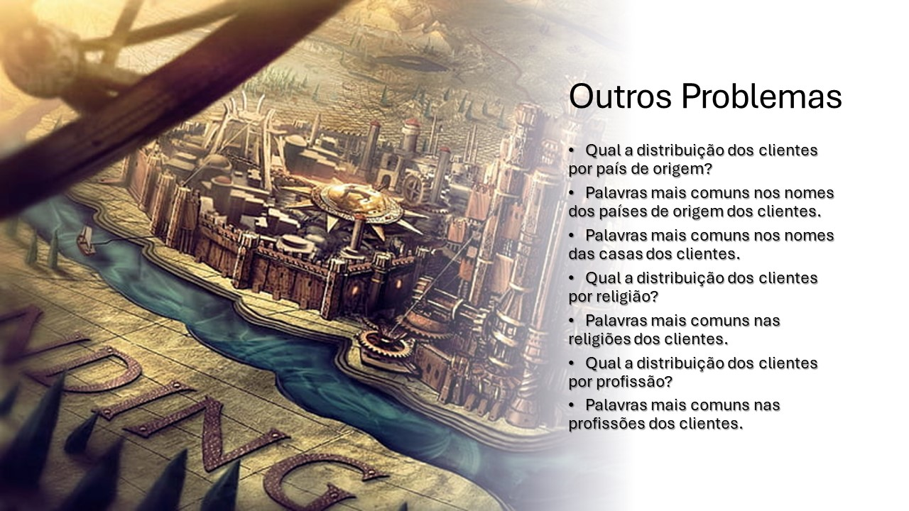
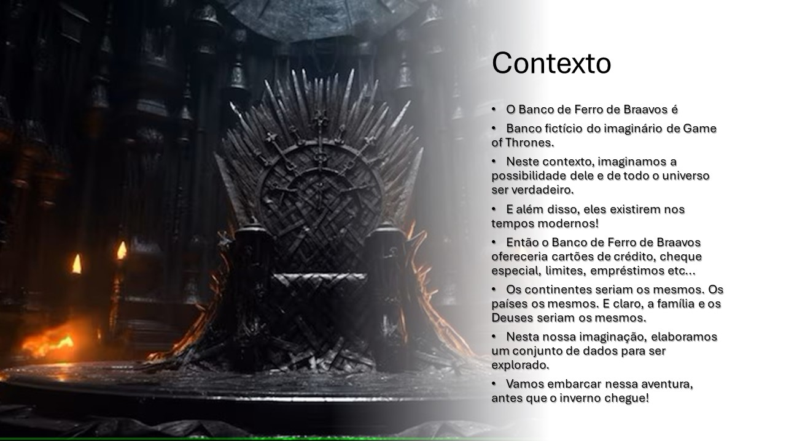
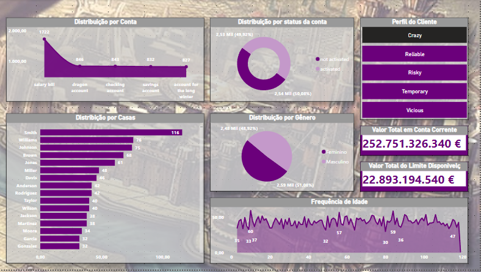
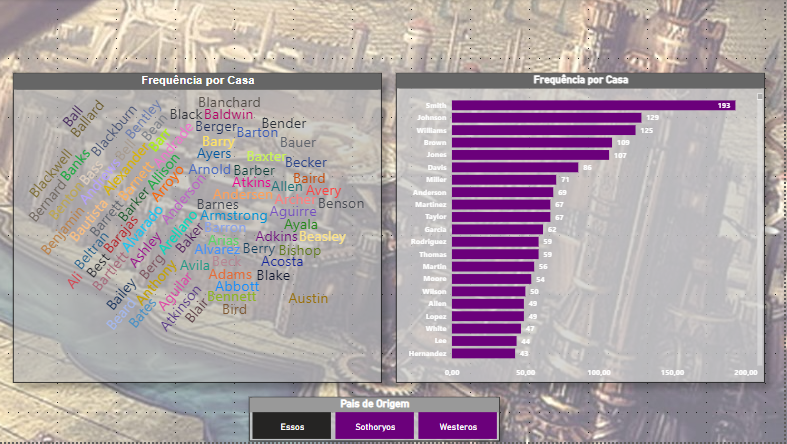
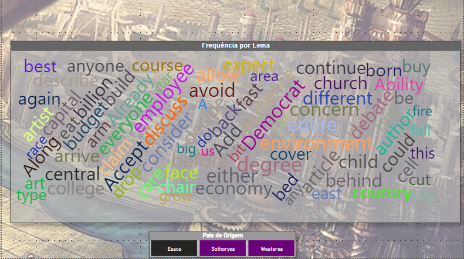
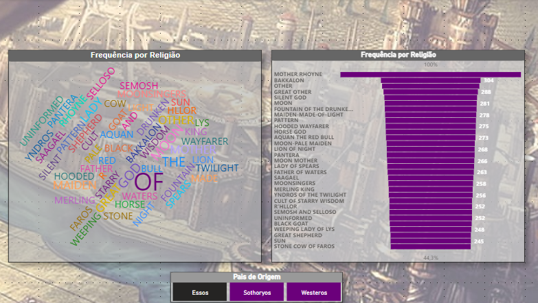
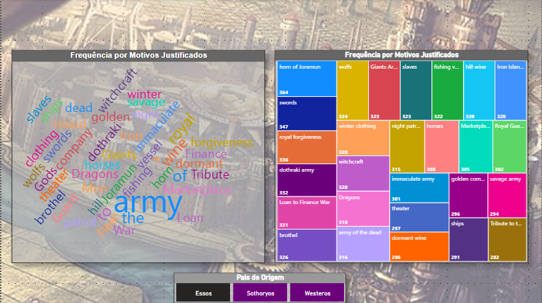

<h1 align="center">
  
</h1>

# CASE BANCO BRAAVOS DE GAME OF THRONES POR CRISTIANE RODRIGUES

## Sobre o Projeto

Este é um projeto fictício que consiste na criação de um relatório em dashboard sobre dados demograficos e financeiros dos clientes
do Banco de Ferro da Cidade de Braavos. Os Dados foram criados por mim para fins de estudo e apresentação.

## Problema 1

## Problema 2

## CONTEXTO

## SOLUÇÃO

